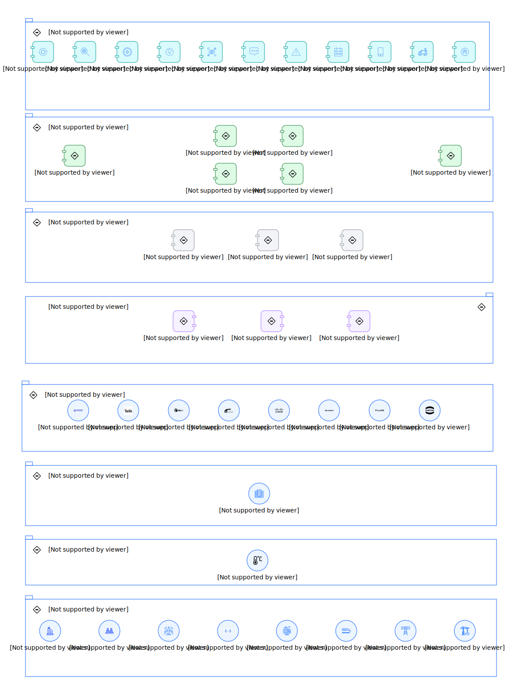

---
tags:
    - AOD-Ent
---

#  Intelligent Asset Reference Architecture

### Reference(s)

    
        
[Intelligent Asset Inspection](https://w3.ibm.com/tools/cogarch/architectures/Collaboration/arch_BJPQhnWzh/itsystem/artifacttype_355f72be-6566-3f48-8b15-c30f671d7c8f/aoditsystem_3T7yfIgjHIh/w)
        
    

## Element(s)

### Actor(s)

| Name | Description | Type | GenericGroup |
| --- | --- | --- | --- |
| ADVANTECH | 
Advantech IoT Edge Gateways help bridge data from edge devices to the cloud, acting as protocol converters, data collectors, or data loggers.
 | IT System |  |
| Aviation Asset | 
Assets from the Aviation Facilities
 | IT System |  |
| Building Asset | 
Assets from the Commercial and Industrial Buildings
 | IT System |  |
| CISCO | 
CISCO edge device collects and processes data from sensors and other IoT devices at the network's edge before transmitting that data to a central system for analysis and processing.
 | IT System |  |
| Civil & Infrastructure Asset | 
Assets from the Cil and Infrastructure Facilities
 | IT System |  |
| Control System | 
A control system uses sensors and actuators to monitor and control the operation of a system or process. Control systems also can be used to automatically adjust the operation of a system based on predetermined set points, as well as to respond to changes in the environment or to commands from operators.
 | IT System | 
<strong>SubSystem,Maximo Application Suite Core</strong>[Auto-Generated]

This group is derived from SubSystem named Maximo Application Suite Core.
 |
| Energy & Utility Asset | 
Assets from the Energy &amp; Utility Facilities
 | IT System |  |
| FLUKE | 
Fluke enables its devices to connect to the internet and transmit data to the cloud or on-premise systems for analysis and processing.
 | IT System |  |
| HARTING | 
HARTING edge devices collect and process data from sensors and other IoT devices at the edge of a network before transmitting that data to a central system for analysis and processing.
 | IT System |  |
| HILSCHER | 
HILSCHER gateways help aggregate, process, or transmit IoT information of your production process completely autonomously to a central system for analysis and processing.
 | IT System |  |
| Life Science Asset | 
Assets from the Life Science Facilities
 | IT System |  |
| Manufacturing Asset | 
Assets from the Manufacturing Facilities
 | IT System |  |
| Oil & Gas Asset | 
Assets from the Oil and Gas Facilities
 | IT System |  |
| Omnio | 
Omnio Edge is a middleware application that runs on gateways connected to your gateways.
 | IT System |  |
| OSISOFT | 
OSIsoft provides lightweight data collection, storage, and access to edge devices and other IoT devices at the edge of a network before transmitting that data to a central system for analysis and processing.
 | IT System |  |
| Sensors | 
IoT sensors are pieces of hardware that detect changes in an environment and collect data.  The type of IoT sensors include:  temperature sensors, proximity sensors, pressure sensors, water quality sensors, chemical and gas sensors, infrared sensors, smoke sensors, motion sensors, and optical sensors to name a few.
 | IT System | 
<strong>SubSystem,Maximo Application Suite Core</strong>[Auto-Generated]

This group is derived from SubSystem named Maximo Application Suite Core.
 |
| TELIT | 
TELIT edge devices collect and process data from sensors and other IoT devices at the edge of a network before transmitting that data to a central system for analysis and processing.
 | IT System |  |
| Transportation Asset | 
Assets from the Transportation Facilities
 | IT System |  |

### Subsystem(s)

| Name | Description | Sub-Diagram |
| --- | --- | --- |
| AI & Analytics Services | The AI &amp; Analytics layer allows customers to sift through their asset data points and extract valuable insights.  |  |
| Application Suite | A comprehensive set of software applications designed to help organizations manage their physical assets, optimize operations, and improve productivity and efficiency. |  |
| Asset | Physical items or equipment that are essential to the operations of the facility. |  |
| Control System | A control system monitors and controls a system's operation or process using sensors and actuators.  |  |
| Data | The data layer will help to store, standardize and normalize data in a meaningful way that asset management applications can consume. |  |
| Edge | Edge devices collect and process and transmit data from sensors and other IoT devices. |  |
| Integration | The integration layer enables the exchange of data and information to optimize asset management.  |  |
| Sensors | A device measures physical or environmental conditions in a building or facility.  |  |

### Logical Component(s)

Analytics Engine

<table>
    <caption></caption>
    <tr>
        <td> <strong>Name</strong> </td>
        <td>Analytics Engine</td>
    </tr>
    <tr>
        <td> <strong>Description</strong> </td>
        <td>
Analytics engines analyze data from various systems to optimize overall asset performance and management.
</td>
    </tr>
</table>

    

Analytics Studio

<table>
    <caption></caption>
    <tr>
        <td> <strong>Name</strong> </td>
        <td>Analytics Studio</td>
    </tr>
    <tr>
        <td> <strong>Description</strong> </td>
        <td>
Templates for detecting anomalies and predicting asset failures of assets
</td>
    </tr>
    <tr>
        <td> <strong>Primary Capability</strong> </td>
        <td>
analytic & ai
</td>
    </tr>
</table>

    

Application Connection Services

<table>
    <caption></caption>
    <tr>
        <td> <strong>Name</strong> </td>
        <td>Application Connection Services</td>
    </tr>
    <tr>
        <td> <strong>Description</strong> </td>
        <td>
Connect applications and data with prebuilt smart connectors.
</td>
    </tr>
    <tr>
        <td> <strong>Primary Capability</strong> </td>
        <td>
api management
</td>
    </tr>
</table>

    

Assist

<table>
    <caption></caption>
    <tr>
        <td> <strong>Name</strong> </td>
        <td>Assist</td>
    </tr>
    <tr>
        <td> <strong>Description</strong> </td>
        <td>
Provide technicians with AI-powered guidance through a knowledge base of equipment maintenance data and gives them remote access to experts for assistance. Using an intuitive mobile interface, technicians can diagnose equipment problems, find recommended solutions, and collaborate with experts to resolve problems.
</td>
    </tr>
    <tr>
        <td> <strong>Primary Capability</strong> </td>
        <td>
application
</td>
    </tr>
</table>

    

Data Dictionary

<table>
    <caption></caption>
    <tr>
        <td> <strong>Name</strong> </td>
        <td>Data Dictionary</td>
    </tr>
    <tr>
        <td> <strong>Description</strong> </td>
        <td>
Catalog and communicate the structure and content of data, and provides meaningful descriptions for individually named data objects.
</td>
    </tr>
    <tr>
        <td> <strong>Primary Capability</strong> </td>
        <td>
metastore
</td>
    </tr>
</table>

    

Data Lake Services

<table>
    <caption></caption>
    <tr>
        <td> <strong>Name</strong> </td>
        <td>Data Lake Services</td>
    </tr>
    <tr>
        <td> <strong>Description</strong> </td>
        <td>
Centralized repository that allows you to store all structured and unstructured data at any scale.
</td>
    </tr>
    <tr>
        <td> <strong>Primary Capability</strong> </td>
        <td>
data lake
</td>
    </tr>
</table>

    

Data Synchronization

<table>
    <caption></caption>
    <tr>
        <td> <strong>Name</strong> </td>
        <td>Data Synchronization</td>
    </tr>
    <tr>
        <td> <strong>Description</strong> </td>
        <td>
Synchronizing organization, site, asset, and location data from Maximo Manage to the data dictionary
</td>
    </tr>
    <tr>
        <td> <strong>Primary Capability</strong> </td>
        <td>
data
</td>
    </tr>
</table>

    

Device Connection Services

<table>
    <caption></caption>
    <tr>
        <td> <strong>Name</strong> </td>
        <td>Device Connection Services</td>
    </tr>
    <tr>
        <td> <strong>Description</strong> </td>
        <td>
IoT device message broker for device registration, IoT data management, and IoT device management. Connect and control IoT devices. Provides secure communication to and from your devices by using MQTT and TLS.
</td>
    </tr>
    <tr>
        <td> <strong>Primary Capability</strong> </td>
        <td>
integration
</td>
    </tr>
</table>

    

Health

<table>
    <caption></caption>
    <tr>
        <td> <strong>Name</strong> </td>
        <td>Health</td>
    </tr>
    <tr>
        <td> <strong>Description</strong> </td>
        <td>
Manage the health of your assets using IoT data from asset sensors, asset records and work history to increase asset availability and improve replacement planning. Get a true view of asset health via dashboard displays to provide evidence to base operational decisions.
</td>
    </tr>
    <tr>
        <td> <strong>Functional Requirement</strong> </td>
        <td>
MAS Health - Maximo Application Suite: Health Functional Requirement
</td>
    </tr>
</table>

    

Industries

<table>
    <caption></caption>
    <tr>
        <td> <strong>Name</strong> </td>
        <td>Industries</td>
    </tr>
    <tr>
        <td> <strong>Description</strong> </td>
        <td>
Industry applications include:  (1) Energy and Utilities: Create efficient, reliable, sustainable utility operations. Learn how you can calculate potential impacts to the grid, monitor asset health, anticipate failures and better plan maintenance procedures. (2) Oil and gas: Create safer, more efficient and reliable operations. Learn how you can improve maintenance practices and plans, enhance HSE practices and rise above the commoditization of products. (3) Manufacturing: Jumpstart your Industry 4.0 transformation, get peak performance from your manufacturing assets, and reduce defects and downtime. Learn how you can create more sustainable operations. (4) Travel and Transportation: Keep everyone and everything moving by improving the productivity of your assets. Learn how you can manage assets and maintenance to meet safety, regulatory and customer demands. (5) Government:  Improve safety and better monitor critical infrastructure. Learn how you can manage assets, make faster, smarter decisions and balance citizen expectation with leaner operations.
</td>
    </tr>
    <tr>
        <td> <strong>Primary Capability</strong> </td>
        <td>
application
</td>
    </tr>
</table>

    

Information Management Services

<table>
    <caption></caption>
    <tr>
        <td> <strong>Name</strong> </td>
        <td>Information Management Services</td>
    </tr>
    <tr>
        <td> <strong>Description</strong> </td>
        <td>
Information management service that supports transaction processing.
</td>
    </tr>
    <tr>
        <td> <strong>Primary Capability</strong> </td>
        <td>
data
</td>
    </tr>
</table>

    

IoT Platform & Data Pipelines

<table>
    <caption></caption>
    <tr>
        <td> <strong>Name</strong> </td>
        <td>IoT Platform & Data Pipelines</td>
    </tr>
    <tr>
        <td> <strong>Description</strong> </td>
        <td>
Provides device connectivity, data filtering and mapping, and device management.  Add metric data that IoT monitoring systems gather from sensor devices to meters.
</td>
    </tr>
    <tr>
        <td> <strong>Primary Capability</strong> </td>
        <td>
information model
</td>
    </tr>
</table>

    

Manage

<table>
    <caption></caption>
    <tr>
        <td> <strong>Name</strong> </td>
        <td>Manage</td>
    </tr>
    <tr>
        <td> <strong>Description</strong> </td>
        <td>
Reduce downtime and costs by optimizing asset management and maintenance processes to improve operational performance. Leverage embedded industry expertise with best-practice data models and workflows to accelerate your industry transformation. Unify asset management processes using role-based workspaces to help teams across your enterprise. Unify robust asset life cycle and maintenance management activities, providing insight into all enterprise assets, their conditions and work processes to achieve better planning and control.
</td>
    </tr>
    <tr>
        <td> <strong>Functional Requirement</strong> </td>
        <td>
MAS Manage - Maximo Application Suite: Manage Functioanl Requirement
</td>
    </tr>
</table>

    

Message Services

<table>
    <caption></caption>
    <tr>
        <td> <strong>Name</strong> </td>
        <td>Message Services</td>
    </tr>
    <tr>
        <td> <strong>Description</strong> </td>
        <td>
The message services provides the configuration of the Java Message Serve resources for scalability and the configuration of  the messaging engines for highly availability.
</td>
    </tr>
    <tr>
        <td> <strong>Primary Capability</strong> </td>
        <td>
messaging
</td>
    </tr>
</table>

    

Mobile

<table>
    <caption></caption>
    <tr>
        <td> <strong>Name</strong> </td>
        <td>Mobile</td>
    </tr>
    <tr>
        <td> <strong>Description</strong> </td>
        <td>
Manage any asset, anytime, any place. Built on next generation mobile technology, Maximo Mobile boosts productivity by giving field technicians the power to easily navigate a single, intuitive platform and find the right asset history and operational data —even in the most remote locations, online or offline—all in the palm of their hand.
</td>
    </tr>
    <tr>
        <td> <strong>Primary Capability</strong> </td>
        <td>
application
</td>
    </tr>
</table>

    

Monitor

<table>
    <caption></caption>
    <tr>
        <td> <strong>Name</strong> </td>
        <td>Monitor</td>
    </tr>
    <tr>
        <td> <strong>Description</strong> </td>
        <td>
Improve asset and operational availability with advanced AI-powered remote asset monitoring at scale. Collect data from your existing OT systems, an converge your IT systems and operational systems in a single data lake to detect anomalies.
</td>
    </tr>
    <tr>
        <td> <strong>Functional Requirement</strong> </td>
        <td>
MAS Monitor - Maximo Application Suite: Monitor Functional Requirements
</td>
    </tr>
</table>

    

Partner or Enterprise-developed

<table>
    <caption></caption>
    <tr>
        <td> <strong>Name</strong> </td>
        <td>Partner or Enterprise-developed</td>
    </tr>
    <tr>
        <td> <strong>Description</strong> </td>
        <td>
Highly customizable and extensible Maximo applications developed by business partners will provide new capabilities and integrations to meet customer-specific business needs.
</td>
    </tr>
    <tr>
        <td> <strong>Primary Capability</strong> </td>
        <td>
application
</td>
    </tr>
</table>

    

Predict

<table>
    <caption></caption>
    <tr>
        <td> <strong>Name</strong> </td>
        <td>Predict</td>
    </tr>
    <tr>
        <td> <strong>Description</strong> </td>
        <td>
Go beyond time-scheduled maintenance to condition-based action to predict the likelihood of future failures by applying machine learning and data analytics to reduce cost and asset failures. Build on the power of other Maximo capabilities and Watson Studio to make data-driven decisions and build predictive models.
</td>
    </tr>
    <tr>
        <td> <strong>Functional Requirement</strong> </td>
        <td>
MAS Predict - Maximo Application Suite: Predict Functional Requirement
</td>
    </tr>
</table>

    

Rules & Alerts

<table>
    <caption></caption>
    <tr>
        <td> <strong>Name</strong> </td>
        <td>Rules & Alerts</td>
    </tr>
    <tr>
        <td> <strong>Description</strong> </td>
        <td>
Rules and alerts engine helps customers identify and address potential issues with their assets on time, reducing downtime and maintenance costs.
</td>
    </tr>
    <tr>
        <td> <strong>Primary Capability</strong> </td>
        <td>
analytic & ai
</td>
    </tr>
</table>

    

Safety

<table>
    <caption></caption>
    <tr>
        <td> <strong>Name</strong> </td>
        <td>Safety</td>
    </tr>
    <tr>
        <td> <strong>Description</strong> </td>
        <td>
Transform business models by integrating work, asset management, and health and safety functions. Help businesses improve operational efficiency and effectiveness, and help businesses meet their safety requirements and regulatory and compliance standards.
</td>
    </tr>
    <tr>
        <td> <strong>Primary Capability</strong> </td>
        <td>
application
</td>
    </tr>
</table>

    

Schedule

<table>
    <caption></caption>
    <tr>
        <td> <strong>Name</strong> </td>
        <td>Schedule</td>
    </tr>
    <tr>
        <td> <strong>Description</strong> </td>
        <td>
Transform business models by integrating work, asset management, and health and safety functions. Help businesses improve operational efficiency and effectiveness, and help businesses meet their safety requirements and regulatory and compliance standards.
</td>
    </tr>
    <tr>
        <td> <strong>Primary Capability</strong> </td>
        <td>
application
</td>
    </tr>
</table>

    

Secure Integration

<table>
    <caption></caption>
    <tr>
        <td> <strong>Name</strong> </td>
        <td>Secure Integration</td>
    </tr>
    <tr>
        <td> <strong>Description</strong> </td>
        <td>
The integration layer consists of adapters, enterprise services, and publish channels. Use adapters to group enterprise services and publish channels to meet your transaction needs. With enterprise services and publish channels, you can receive data from and send data to multiple external systems and applications.
</td>
    </tr>
</table>

    

Visual Inspection

<table>
    <caption></caption>
    <tr>
        <td> <strong>Name</strong> </td>
        <td>Visual Inspection</td>
    </tr>
    <tr>
        <td> <strong>Description</strong> </td>
        <td>
Perform a visual inspection of the line or asset using commercial, off-the-shelf iOS devices to get immediate, actionable notifications of any emerging issue. Scale easily to view multiple points 24/7 including global views of all plants and geographies. Integrate with maintenance and quality workflows for a fast and prescriptive response.
</td>
    </tr>
    <tr>
        <td> <strong>Functional Requirement</strong> </td>
        <td>
MAS Visual Inspection - Maximo Application Suite: Visual Inspection Functional Requirements
</td>
    </tr>
</table>

    

