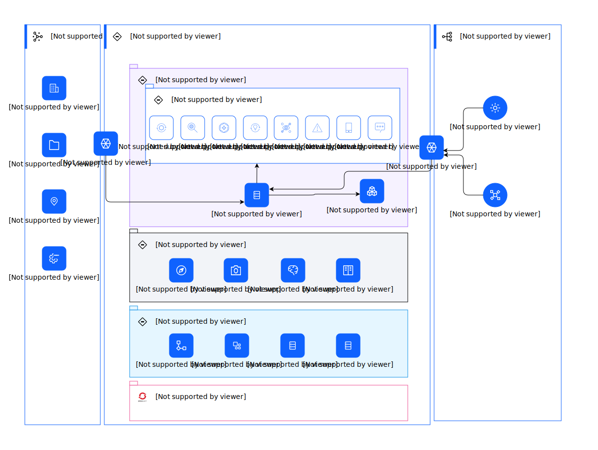

---
tags:
    - AOD-ITS
---

#  Deployment Overview

## Element(s)

### Actor(s)

| Name | Description | Type | GenericGroup |
| --- | --- | --- | --- |
| 3rd Party System | 
Third party applications external to Maximo Application Suite Core
 | IT System |  |
| Weather System | 
The weather system provides weather information, tracks patterns, and predicts trends.
 | IT System |  |

### Subsystem(s)

| Name | Description | Sub-Diagram |
| --- | --- | --- |
| Applications | IBM Maximo Safety enables companies to establish safer working environments by providing safety insights for proactive protection with personalized risk assessment and near real-time protection. These insights and protection can minimize workplace hazards. |  |
| Cloud Pak 4 Data | 
One prerequisite, which must run in the Red Hat OpenShift cluster is the Cloud Pak for Data. 

 

Cloud Pak for Data consists of a control plane, which has its own user interface and its own set of authorized users. After you install Cloud Pak for Data into Red Hat OpenShift cluster and you log in as an administrator, you can install one or more Cloud Pak for Data services into the Red Hat OpenShift cluster. In particular, you can use it to install the DB2 Warehouse that is used by the Maximo Monitor and IoT applications. 

 

The Maximo Application Suite license entitles you to install and use a number of theCloud Pak for Data services, provided you are using them with Maximo Application Suite applications.
  |  |
| Maximo Application Suite Core | Start by installing a control plane, Maximo Application Suite core, into Red Hat OpenShift cluster. Use Maximo Application Suite core to install and manage the Maximo Application Suite applications, industry solutions, and add-ons that you want to use. Maximo Application Suite core maintains a registry of users. You can specify which users are to be permitted to access which Maximo Application Suite applications. |  |
| Maximo Application Suite Prerequisites | Maximo Application Suite applications have several dependencies or prerequisites. Some of these are required regardless of which applications you use, others are use by specific applications. Choose whether to deploy prerequisites in the Red Hat OpenShift cluster or run them externally,either in a separate Red Hat OpenShift cluster, or by using an external service provider. |  |
| OpenShift | The Red Hat OpenShift Container Platform cluster is managed by a set of master nodes. These master nodes run the Kubernetes cluster control software, managing what runs on the other nodes in the cluster (the worker nodes). The master nodes also maintain an internal database (etcd) of containing the Kubernetes resource definitions. To ensure continuous and high availability of the Red Hat OpenShift Container Platform cluster uses a minimum of three master nodes.   |  |

### Location(s)

| Name | Description |
| --- | --- | 
 | Client Network |  |
 | Platform | cloud or on-prem |
 | Public Network |  |

### Logical Connection(s)

All connections are not named.

    

### Logical Node(s)

    

Enterprise Assets

<table>
    <caption></caption>
    <tr>
        <td> <strong>Name</strong> </td>
        <td>Enterprise Assets</td>
    </tr>
    <tr>
        <td> <strong>Description</strong> </td>
        <td>
Enterprise Assets are a company's physical capital investments used for production.
</td>
    </tr>
    <tr>
        <td> <strong>Primary Capability</strong> </td>
        <td>
                
iot

                
IoT
</td>
    </tr>
    <tr>
        <td> <strong>Related Diagrams</strong> </td>
        <td>
                
<a href="../../../Architecture-Overview/IT-System-View/Deployment-Overview">Deployment Overview</a>
</td>
    </tr>
</table>

    

App Connect

<table>
    <caption></caption>
    <tr>
        <td> <strong>Name</strong> </td>
        <td>App Connect</td>
    </tr>
    <tr>
        <td> <strong>Description</strong> </td>
        <td>
Use App Connect to connect your different applications and make your business more efficient. Set up flows that define how data is moved fromone application to one or more other applications. App Connect supports a range of skill levels and interfaces, giving you the flexibility to create integrations without writing a single line of code. You can use a web user interface or drop resources into a toolkit that gives a broader range of configuration options. Your entire organization can make smarter business decisions by providing rapid access, visibility, and control over data as it flows through your business applications and systems from a single place - App Connect.
</td>
    </tr>
    <tr>
        <td> <strong>Primary Capability</strong> </td>
        <td>
                
api management
</td>
    </tr>
    <tr>
        <td> <strong>Generic Group</strong> </td>
        <td>
                
<strong>SubSystem,Maximo Application Suite Prerequisites</strong>[Auto-Generated]

                
This group is derived from SubSystem named Maximo Application Suite Prerequisites.
</td>
    </tr>
    <tr>
        <td> <strong>Related Diagrams</strong> </td>
        <td>
                
<a href="../../../Architecture-Overview/IT-System-View/Deployment-Overview">Deployment Overview</a>
</td>
    </tr>
</table>

    

Assist

<table>
    <caption></caption>
    <tr>
        <td> <strong>Name</strong> </td>
        <td>Assist</td>
    </tr>
    <tr>
        <td> <strong>Description</strong> </td>
        <td>
Maximo Assist helps to reduce the time that is required to diagnose and repair equipment problems, improves first-time fix rates, improves diagnosis accuracy, and drives higher levels of technician productivity.  
</td>
    </tr>
    <tr>
        <td> <strong>Primary Capability</strong> </td>
        <td>
                
application
</td>
    </tr>
    <tr>
        <td> <strong>Generic Group</strong> </td>
        <td>
                
<strong>SubSystem,Applications</strong>[Auto-Generated]

                
This group is derived from SubSystem named Applications.
</td>
    </tr>
    <tr>
        <td> <strong>Related Diagrams</strong> </td>
        <td>
                
<a href="../../../Architecture-Overview/IT-System-View/Deployment-Overview">Deployment Overview</a>
</td>
    </tr>
</table>

    

CAD Files

<table>
    <caption></caption>
    <tr>
        <td> <strong>Name</strong> </td>
        <td>CAD Files</td>
    </tr>
    <tr>
        <td> <strong>Description</strong> </td>
        <td>
CAD (computer-aided design) files are digital files that house 3D &amp; 2D designs as well as information regarding materials, processes, tolerances, and other data.
</td>
    </tr>
    <tr>
        <td> <strong>Primary Capability</strong> </td>
        <td>
                
source
</td>
    </tr>
    <tr>
        <td> <strong>Related Diagrams</strong> </td>
        <td>
                
<a href="../../../Architecture-Overview/IT-System-View/Deployment-Overview">Deployment Overview</a>
</td>
    </tr>
</table>

    

CouchDb

<table>
    <caption></caption>
    <tr>
        <td> <strong>Name</strong> </td>
        <td>CouchDb</td>
    </tr>
    <tr>
        <td> <strong>Description</strong> </td>
        <td>
CouchDB is embedded and automatically deployed with Maximo Assist. You do not have to manually install it.
</td>
    </tr>
    <tr>
        <td> <strong>Primary Capability</strong> </td>
        <td>
                
NOSQL
</td>
    </tr>
    <tr>
        <td> <strong>Generic Group</strong> </td>
        <td>
                
<strong>SubSystem,Maximo Application Suite Prerequisites</strong>[Auto-Generated]

                
This group is derived from SubSystem named Maximo Application Suite Prerequisites.
</td>
    </tr>
    <tr>
        <td> <strong>Related Diagrams</strong> </td>
        <td>
                
<a href="../../../Architecture-Overview/IT-System-View/Deployment-Overview">Deployment Overview</a>
</td>
    </tr>
</table>

    

Database

<table>
    <caption></caption>
    <tr>
        <td> <strong>Name</strong> </td>
        <td>Database</td>
    </tr>
    <tr>
        <td> <strong>Description</strong> </td>
        <td>
Asset data
</td>
    </tr>
    <tr>
        <td> <strong>Primary Capability</strong> </td>
        <td>
                
data
</td>
    </tr>
    <tr>
        <td> <strong>Implementation</strong> </td>
        <td>
                
<a href="">DB2 Warehouse</a>

                
<a href="">Oracle</a>
</td>
    </tr>
    <tr>
        <td> <strong>Generic Group</strong> </td>
        <td>
                
<strong>SubSystem,MAS</strong>[Auto-Generated]

                
This group is derived from SubSystem named MAS.

                
<strong>SubSystem,Maximo Application Suite Core</strong>[Auto-Generated]

                
This group is derived from SubSystem named Maximo Application Suite Core.

                
<strong>SubSystem,Maximo Application Suite</strong>[Auto-Generated]

                
This group is derived from SubSystem named Maximo Application Suite.
</td>
    </tr>
    <tr>
        <td> <strong>Related Diagrams</strong> </td>
        <td>
                
<a href="../../../Architecture-Overview/IT-System-View/Deployment-Overview">Deployment Overview</a>
</td>
    </tr>
        <tr>
        <td> <strong>Related Elements</strong> </td>
        <td>
                
SYS_DU_3V0vmL2m4je

                
SYS_DU_3V0vmL0r2yw

        </td>
    </tr>
</table>

    

DB2 Warehouse

<table>
    <caption></caption>
    <tr>
        <td> <strong>Name</strong> </td>
        <td>DB2 Warehouse</td>
    </tr>
    <tr>
        <td> <strong>Description</strong> </td>
        <td>
IBM Db2 Warehouse is an analytics data warehouse that features in-memory data processing and in-database analytics. The Cloud Pak for Data control plane is not required to install Db2; alternatively, the Db2U operator can be installed standalone. For  					Maximo Application Suite users that require Maximo Predict or Maximo Assist applications Cloud Pak for Data is required to install the Watson Studio or Watson Discovery dependencies.
</td>
    </tr>
    <tr>
        <td> <strong>Primary Capability</strong> </td>
        <td>
                
warehouse
</td>
    </tr>
    <tr>
        <td> <strong>Generic Group</strong> </td>
        <td>
                
<strong>SubSystem,Cloud Pak 4 Data</strong>[Auto-Generated]

                
This group is derived from SubSystem named Cloud Pak 4 Data.
</td>
    </tr>
    <tr>
        <td> <strong>Related Diagrams</strong> </td>
        <td>
                
<a href="../../../Architecture-Overview/IT-System-View/Deployment-Overview">Deployment Overview</a>
</td>
    </tr>
</table>

    

Discovery

<table>
    <caption></caption>
    <tr>
        <td> <strong>Name</strong> </td>
        <td>Discovery</td>
    </tr>
    <tr>
        <td> <strong>Description</strong> </td>
        <td>
Watson Discovery for Cloud Pak for Data is an award-winning AI-powered intelligent search and text-analytics platform that helps you find valuable information that is buried in your enterprise data. Discovery uses innovative, market-leading natural language processing to uncover meaningful insights from complex business documents.
</td>
    </tr>
    <tr>
        <td> <strong>Primary Capability</strong> </td>
        <td>
                
discovery
</td>
    </tr>
    <tr>
        <td> <strong>Generic Group</strong> </td>
        <td>
                
<strong>SubSystem,Cloud Pak 4 Data</strong>[Auto-Generated]

                
This group is derived from SubSystem named Cloud Pak 4 Data.
</td>
    </tr>
    <tr>
        <td> <strong>Related Diagrams</strong> </td>
        <td>
                
<a href="../../../Architecture-Overview/IT-System-View/Deployment-Overview">Deployment Overview</a>
</td>
    </tr>
</table>

    

Health

<table>
    <caption></caption>
    <tr>
        <td> <strong>Name</strong> </td>
        <td>Health</td>
    </tr>
    <tr>
        <td> <strong>Description</strong> </td>
        <td>
With Maximo Health, you can review your assets’ performance and condition indicators, such as the last failure date and the maintenance-to-replacement ratio (MRR),and take action by creating work orders and service requests. You can use work queues to improve the quality of your asset’s details and related data. You can also configure scoring for assets’ health,criticality, and risk.
</td>
    </tr>
    <tr>
        <td> <strong>Primary Capability</strong> </td>
        <td>
                
application
</td>
    </tr>
    <tr>
        <td> <strong>Generic Group</strong> </td>
        <td>
                
<strong>SubSystem,Applications</strong>[Auto-Generated]

                
This group is derived from SubSystem named Applications.

                
<strong>SubSystem,Application Suite</strong>[Auto-Generated]

                
This group is derived from SubSystem named Application Suite.
</td>
    </tr>
    <tr>
        <td> <strong>Related Diagrams</strong> </td>
        <td>
                
<a href="../../../Architecture-Overview/IT-System-View/Deployment-Overview">Deployment Overview</a>
</td>
    </tr>
</table>

    

Integration & Connection Services

<table>
    <caption></caption>
    <tr>
        <td> <strong>Name</strong> </td>
        <td>Integration & Connection Services</td>
    </tr>
    <tr>
        <td> <strong>Description</strong> </td>
        <td>
Most applications require access to data or computations that are provided by another system, or applications need to respond to requests from other systems for data or computations. The approaches, technologies, and facilities that support accessing data are collectively known as integration and connection services.
</td>
    </tr>
    <tr>
        <td> <strong>Primary Capability</strong> </td>
        <td>
                
integration
</td>
    </tr>
    <tr>
        <td> <strong>Related Diagrams</strong> </td>
        <td>
                
<a href="../../../Architecture-Overview/IT-System-View/Deployment-Overview">Deployment Overview</a>
</td>
    </tr>
</table>

    

Kafka

<table>
    <caption></caption>
    <tr>
        <td> <strong>Name</strong> </td>
        <td>Kafka</td>
    </tr>
    <tr>
        <td> <strong>Description</strong> </td>
        <td>
Apache Kafka provides a buffer for messages sent to and received from externalinterfaces. Apache Kafka is not required if the IBM® Maximo® Manage software is notinterfacing with external systems.
</td>
    </tr>
    <tr>
        <td> <strong>Primary Capability</strong> </td>
        <td>
                
event streaming
</td>
    </tr>
    <tr>
        <td> <strong>Generic Group</strong> </td>
        <td>
                
<strong>SubSystem,Maximo Application Suite Prerequisites</strong>[Auto-Generated]

                
This group is derived from SubSystem named Maximo Application Suite Prerequisites.
</td>
    </tr>
    <tr>
        <td> <strong>Related Diagrams</strong> </td>
        <td>
                
<a href="../../../Architecture-Overview/IT-System-View/Deployment-Overview">Deployment Overview</a>
</td>
    </tr>
</table>

    

Location Files

<table>
    <caption></caption>
    <tr>
        <td> <strong>Name</strong> </td>
        <td>Location Files</td>
    </tr>
    <tr>
        <td> <strong>Description</strong> </td>
        <td>
The location of files is where digital files [for example, documents, drawings, images, videos, maintenance records, etc.] related to the assets are stored.
</td>
    </tr>
    <tr>
        <td> <strong>Primary Capability</strong> </td>
        <td>
                
source
</td>
    </tr>
    <tr>
        <td> <strong>Related Diagrams</strong> </td>
        <td>
                
<a href="../../../Architecture-Overview/IT-System-View/Deployment-Overview">Deployment Overview</a>
</td>
    </tr>
</table>

    

Manage

<table>
    <caption></caption>
    <tr>
        <td> <strong>Name</strong> </td>
        <td>Manage</td>
    </tr>
    <tr>
        <td> <strong>Description</strong> </td>
        <td>
Maximo Manage provides a comprehensive view of all asset types, their conditions and locations, and the work processes that support them, to provide you with optimal planning, control, audit, and compliance capability.
</td>
    </tr>
    <tr>
        <td> <strong>Primary Capability</strong> </td>
        <td>
                
application
</td>
    </tr>
    <tr>
        <td> <strong>Generic Group</strong> </td>
        <td>
                
<strong>SubSystem,Application Suite</strong>[Auto-Generated]

                
This group is derived from SubSystem named Application Suite.

                
<strong>SubSystem,Applications</strong>[Auto-Generated]

                
This group is derived from SubSystem named Applications.
</td>
    </tr>
    <tr>
        <td> <strong>Related Diagrams</strong> </td>
        <td>
                
<a href="../../../Architecture-Overview/IT-System-View/Deployment-Overview">Deployment Overview</a>
</td>
    </tr>
</table>

    

ML

<table>
    <caption></caption>
    <tr>
        <td> <strong>Name</strong> </td>
        <td>ML</td>
    </tr>
    <tr>
        <td> <strong>Description</strong> </td>
        <td>
Watson Machine Learning provides a full range of tools and services so that you can build, train, and deploy Machine Learning models. Choose the tool with the level of automation or autonomy that matches your needs, from a fully automated process to writing your own code.
</td>
    </tr>
    <tr>
        <td> <strong>Primary Capability</strong> </td>
        <td>
                
machine learning
</td>
    </tr>
    <tr>
        <td> <strong>Generic Group</strong> </td>
        <td>
                
<strong>SubSystem,Cloud Pak 4 Data</strong>[Auto-Generated]

                
This group is derived from SubSystem named Cloud Pak 4 Data.
</td>
    </tr>
    <tr>
        <td> <strong>Related Diagrams</strong> </td>
        <td>
                
<a href="../../../Architecture-Overview/IT-System-View/Deployment-Overview">Deployment Overview</a>
</td>
    </tr>
</table>

    

Mobile

<table>
    <caption></caption>
    <tr>
        <td> <strong>Name</strong> </td>
        <td>Mobile</td>
    </tr>
    <tr>
        <td> <strong>Description</strong> </td>
        <td>
IBM Maximo mobile solutions deliver remote and AI-based expert assistance, real-time asset history and operational data from wearables, safety sensors and diagnostic interfaces to the digital twin.
</td>
    </tr>
    <tr>
        <td> <strong>Primary Capability</strong> </td>
        <td>
                
application
</td>
    </tr>
    <tr>
        <td> <strong>Generic Group</strong> </td>
        <td>
                
<strong>SubSystem,Applications</strong>[Auto-Generated]

                
This group is derived from SubSystem named Applications.

                
<strong>SubSystem,Application Suite</strong>[Auto-Generated]

                
This group is derived from SubSystem named Application Suite.
</td>
    </tr>
    <tr>
        <td> <strong>Related Diagrams</strong> </td>
        <td>
                
<a href="../../../Architecture-Overview/IT-System-View/Deployment-Overview">Deployment Overview</a>
</td>
    </tr>
</table>

    

MongoDB

<table>
    <caption></caption>
    <tr>
        <td> <strong>Name</strong> </td>
        <td>MongoDB</td>
    </tr>
    <tr>
        <td> <strong>Description</strong> </td>
        <td>
Maximo® Application Suite uses MongoDB for its data dictionary and local user management. Your MongoDB instance can run in the Red Hat® OpenShift® cluster or external toit.
</td>
    </tr>
    <tr>
        <td> <strong>Primary Capability</strong> </td>
        <td>
                
NOSQL
</td>
    </tr>
    <tr>
        <td> <strong>Generic Group</strong> </td>
        <td>
                
<strong>SubSystem,Maximo Application Suite Prerequisites</strong>[Auto-Generated]

                
This group is derived from SubSystem named Maximo Application Suite Prerequisites.
</td>
    </tr>
    <tr>
        <td> <strong>Related Diagrams</strong> </td>
        <td>
                
<a href="../../../Architecture-Overview/IT-System-View/Deployment-Overview">Deployment Overview</a>
</td>
    </tr>
</table>

    

Monitor

<table>
    <caption></caption>
    <tr>
        <td> <strong>Name</strong> </td>
        <td>Monitor</td>
    </tr>
    <tr>
        <td> <strong>Description</strong> </td>
        <td>
By using Maximo® Monitor, business users can visualize current and historical trend data for their devices and assets in customizable dashboards. Users can drill down through layers from a system-wide view to individual assets and devices. Analytic functions are applied to input data, and the output is displayed on value cards, tables,images, line graphs, and alert tables. Anomaly detectors run on the input data to detect outliers, gaps, and flat lines in the data and fire alerts. The anomalous data points are highlighted on line graphs.     
</td>
    </tr>
    <tr>
        <td> <strong>Primary Capability</strong> </td>
        <td>
                
application
</td>
    </tr>
    <tr>
        <td> <strong>Generic Group</strong> </td>
        <td>
                
<strong>SubSystem,Application Suite</strong>[Auto-Generated]

                
This group is derived from SubSystem named Application Suite.

                
<strong>SubSystem,Applications</strong>[Auto-Generated]

                
This group is derived from SubSystem named Applications.
</td>
    </tr>
    <tr>
        <td> <strong>Related Diagrams</strong> </td>
        <td>
                
<a href="../../../Architecture-Overview/IT-System-View/Deployment-Overview">Deployment Overview</a>
</td>
    </tr>
</table>

    

Operational Conditions

<table>
    <caption></caption>
    <tr>
        <td> <strong>Name</strong> </td>
        <td>Operational Conditions</td>
    </tr>
    <tr>
        <td> <strong>Description</strong> </td>
        <td>
External data sources can be synchronized with a Data Lake for access by the Analytics Services to create models for asset monitoring, health analysis, optimization and prediction of operational issues. 
</td>
    </tr>
    <tr>
        <td> <strong>Primary Capability</strong> </td>
        <td>
                
information governance
</td>
    </tr>
    <tr>
        <td> <strong>Related Diagrams</strong> </td>
        <td>
                
<a href="../../../Architecture-Overview/IT-System-View/Deployment-Overview">Deployment Overview</a>
</td>
    </tr>
</table>

    

Predict

<table>
    <caption></caption>
    <tr>
        <td> <strong>Name</strong> </td>
        <td>Predict</td>
    </tr>
    <tr>
        <td> <strong>Description</strong> </td>
        <td>
Maximo Predict uses historical and near real-time asset performance data, maintenance records, inspection reports, and environmental data to correlate performance factors that predict asset degradation or failure. Maximo Predict uses artificial intelligence to optimize predictive model accuracy.
</td>
    </tr>
    <tr>
        <td> <strong>Primary Capability</strong> </td>
        <td>
                
application
</td>
    </tr>
    <tr>
        <td> <strong>Generic Group</strong> </td>
        <td>
                
<strong>SubSystem,Application Suite</strong>[Auto-Generated]

                
This group is derived from SubSystem named Application Suite.

                
<strong>SubSystem,Applications</strong>[Auto-Generated]

                
This group is derived from SubSystem named Applications.
</td>
    </tr>
    <tr>
        <td> <strong>Related Diagrams</strong> </td>
        <td>
                
<a href="../../../Architecture-Overview/IT-System-View/Deployment-Overview">Deployment Overview</a>
</td>
    </tr>
</table>

    

Safety

<table>
    <caption></caption>
    <tr>
        <td> <strong>Name</strong> </td>
        <td>Safety</td>
    </tr>
    <tr>
        <td> <strong>Description</strong> </td>
        <td>
IBM Maximo Safety enables companies to establish safer working environments by providing safety insights for proactive protection with personalized risk assessment and near real-time protection. These insights and protection can minimize workplace hazards.
</td>
    </tr>
    <tr>
        <td> <strong>Primary Capability</strong> </td>
        <td>
                
application
</td>
    </tr>
    <tr>
        <td> <strong>Generic Group</strong> </td>
        <td>
                
<strong>SubSystem,Applications</strong>[Auto-Generated]

                
This group is derived from SubSystem named Applications.

                
<strong>SubSystem,Application Suite</strong>[Auto-Generated]

                
This group is derived from SubSystem named Application Suite.
</td>
    </tr>
    <tr>
        <td> <strong>Related Diagrams</strong> </td>
        <td>
                
<a href="../../../Architecture-Overview/IT-System-View/Deployment-Overview">Deployment Overview</a>
</td>
    </tr>
</table>

    

Studio

<table>
    <caption></caption>
    <tr>
        <td> <strong>Name</strong> </td>
        <td>Studio</td>
    </tr>
    <tr>
        <td> <strong>Description</strong> </td>
        <td>
Watson Studio provides the environment and tools for you to collaboratively work on data to solve your business problems. You can choose the tools you need to analyze and visualize data, to cleanse and shape data, to ingest streaming data, or to create and train machine learning models.
</td>
    </tr>
    <tr>
        <td> <strong>Primary Capability</strong> </td>
        <td>
                
analytic & ai
</td>
    </tr>
    <tr>
        <td> <strong>Generic Group</strong> </td>
        <td>
                
<strong>SubSystem,Cloud Pak 4 Data</strong>[Auto-Generated]

                
This group is derived from SubSystem named Cloud Pak 4 Data.
</td>
    </tr>
    <tr>
        <td> <strong>Related Diagrams</strong> </td>
        <td>
                
<a href="../../../Architecture-Overview/IT-System-View/Deployment-Overview">Deployment Overview</a>
</td>
    </tr>
</table>

    

Train Model

<table>
    <caption></caption>
    <tr>
        <td> <strong>Name</strong> </td>
        <td>Train Model</td>
    </tr>
    <tr>
        <td> <strong>Primary Capability</strong> </td>
        <td>
                
machine learning
</td>
    </tr>
    <tr>
        <td> <strong>Generic Group</strong> </td>
        <td>
                
<strong>SubSystem,MAS</strong>[Auto-Generated]

                
This group is derived from SubSystem named MAS.

                
<strong>SubSystem,Maximo Application Suite Core</strong>[Auto-Generated]

                
This group is derived from SubSystem named Maximo Application Suite Core.

                
<strong>SubSystem,Maximo Application Suite</strong>[Auto-Generated]

                
This group is derived from SubSystem named Maximo Application Suite.
</td>
    </tr>
    <tr>
        <td> <strong>Related Diagrams</strong> </td>
        <td>
                
<a href="../../../Architecture-Overview/IT-System-View/Deployment-Overview">Deployment Overview</a>
</td>
    </tr>
</table>

    

Visual Inspection

<table>
    <caption></caption>
    <tr>
        <td> <strong>Name</strong> </td>
        <td>Visual Inspection</td>
    </tr>
    <tr>
        <td> <strong>Description</strong> </td>
        <td>
IBM® Maximo Visual Inspection is a machine-learning application for video and image analysis. IBM Maximo Visual Inspection offers built-in deep learning models that learn to analyze images and video streams for classification and object detection.
</td>
    </tr>
    <tr>
        <td> <strong>Primary Capability</strong> </td>
        <td>
                
application
</td>
    </tr>
    <tr>
        <td> <strong>Generic Group</strong> </td>
        <td>
                
<strong>SubSystem,Application Suite</strong>[Auto-Generated]

                
This group is derived from SubSystem named Application Suite.

                
<strong>SubSystem,Applications</strong>[Auto-Generated]

                
This group is derived from SubSystem named Applications.
</td>
    </tr>
    <tr>
        <td> <strong>Related Diagrams</strong> </td>
        <td>
                
<a href="../../../Architecture-Overview/IT-System-View/Deployment-Overview">Deployment Overview</a>
</td>
    </tr>
</table>

    

