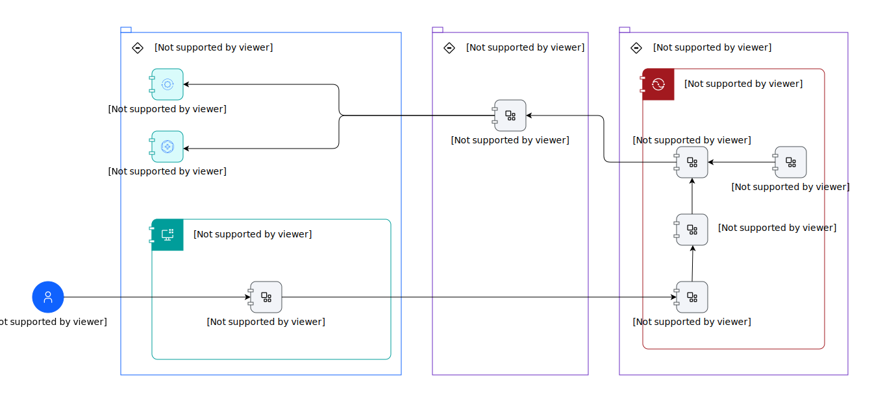

---
tags:
    - AOD-Svc
---

#  Maximo AI Assistant Pattern - Component Model

## Element(s)

### Actor(s)

| Name | Description | Type | GenericGroup |
| --- | --- | --- | --- |
| MAS User-uploaded | 
The Maximo Application Suite allows users to sign on to a single, integrated platform to access key monitoring, maintenance, and reliability applications across the business. Not only does it help remove data silos, it enhances data sharing with integrated user experience and shared administrative controls for enterprise-scale execution. With a new Committed Term License, businesses can access the entire suite with one single entitlement. Users in the organization will have a pool of AppPoints that will allow them to seamlessly move from one application to another, as needed. This enables organizations to pay for only what they use. You can try and deploy new applications without substantial license and administration costs. It also allows your team to deploy new capabilities and grow as well as share industry specific Digital Twin assets and modules.
 | Human | 
<strong>SubSystem,Maximo Application Suite Core</strong>[Auto-Generated]

This group is derived from SubSystem named Maximo Application Suite Core.
 |

### Subsystem(s)

| Name | Description | Sub-Diagram |
| --- | --- | --- |
| Container Runtime |  |  |
| Maximo Application Suite |  |  |
| Watsonx |  |  |

### Logical Component(s)

    

Actions

<table>
    <caption></caption>
    <tr>
        <td> <strong>Name</strong> </td>
        <td>Actions</td>
    </tr> 
    <tr>
        <td> <strong>Description</strong> </td>
        <td>
Provides the functionality to react to cretain actions within the AI Assistant
</td>
    </tr>
</table>

    

Health-uploaded

<table>
    <caption></caption>
    <tr>
        <td> <strong>Name</strong> </td>
        <td>Health-uploaded</td>
    </tr> 
    <tr>
        <td> <strong>Description</strong> </td>
        <td>
Manage the health of your assets using IoT data from asset sensors, asset records and work history to increase asset availability and improve replacement planning. Get a true view of asset health via dashboard displays to provide evidence to base operational decisions.
</td>
    </tr>
    <tr>
        <td> <strong>Primary Capability</strong> </td>
        <td>
application
</td>
    </tr>
    <tr>
        <td> <strong>Functional Requirement</strong> </td>
        <td>
MAS Health-uploaded - Maximo Application Suite: Health Functional Requirement-uploaded
</td>
    </tr>
</table>

    

Manage-uploaded

<table>
    <caption></caption>
    <tr>
        <td> <strong>Name</strong> </td>
        <td>Manage-uploaded</td>
    </tr> 
    <tr>
        <td> <strong>Description</strong> </td>
        <td>
Reduce downtime and costs by optimizing asset management and maintenance processes to improve operational performance. Leverage embedded industry expertise with best-practice data models and workflows to accelerate your industry transformation. Unify asset management processes using role-based workspaces to help teams across your enterprise. Unify robust asset life cycle and maintenance management activities, providing insight into all enterprise assets, their conditions and work processes to achieve better planning and control.
</td>
    </tr>
    <tr>
        <td> <strong>Primary Capability</strong> </td>
        <td>
application
</td>
    </tr>
    <tr>
        <td> <strong>Functional Requirement</strong> </td>
        <td>
MAS Manage WOI - AI: Work Order Intelligence

MAS Manage-uploaded - Maximo Application Suite: Manage Functioanl Requirement-uploaded
</td>
    </tr>
</table>

    

MAS User Interface

<table>
    <caption></caption>
    <tr>
        <td> <strong>Name</strong> </td>
        <td>MAS User Interface</td>
    </tr> 
    <tr>
        <td> <strong>Description</strong> </td>
        <td>
USer Interface for the MAS suite of applications
</td>
    </tr>
    <tr>
        <td> <strong>Primary Capability</strong> </td>
        <td>
application
</td>
    </tr>
</table>

    

Maximo AI Assistant

<table>
    <caption></caption>
    <tr>
        <td> <strong>Name</strong> </td>
        <td>Maximo AI Assistant</td>
    </tr> 
    <tr>
        <td> <strong>Description</strong> </td>
        <td>
Maximo AI Assistant Provides capabilities to allow for determining asset health, examining the work orders for the asset and the creation of work orders for remedying unhealthy assets all through a natural language interface
</td>
    </tr>
</table>

    

Maximo Assistant Embedding Code

<table>
    <caption></caption>
    <tr>
        <td> <strong>Name</strong> </td>
        <td>Maximo Assistant Embedding Code</td>
    </tr> 
    <tr>
        <td> <strong>Description</strong> </td>
        <td>
Code to embed the MAximo AI Assistant into the Maximo Application Suite User Interfaces
</td>
    </tr>
</table>

    

Maximo Custon Extension

<table>
    <caption></caption>
    <tr>
        <td> <strong>Name</strong> </td>
        <td>Maximo Custon Extension</td>
    </tr> 
</table>

    

Maximo Skill Service

<table>
    <caption></caption>
    <tr>
        <td> <strong>Name</strong> </td>
        <td>Maximo Skill Service</td>
    </tr> 
    <tr>
        <td> <strong>Description</strong> </td>
        <td>
Provides the capability to interact with the manage and health applications via the OSLC service that they provide
</td>
    </tr>
</table>

    

Maximo Skill Service OpenAPI specification

<table>
    <caption></caption>
    <tr>
        <td> <strong>Name</strong> </td>
        <td>Maximo Skill Service OpenAPI specification</td>
    </tr> 
    <tr>
        <td> <strong>Description</strong> </td>
        <td>
The OpenAPI Specification for the servceis provided by the Maximo Skill Service component
</td>
    </tr>
</table>

    

Watsonx.orchestrate

<table>
    <caption></caption>
    <tr>
        <td> <strong>Name</strong> </td>
        <td>Watsonx.orchestrate</td>
    </tr> 
    <tr>
        <td> <strong>Description</strong> </td>
        <td>
IBM watsonx Orchestrate, powered by LLMs, is here to help by bringing generative AI and automation to every business domain across the enterprise.
<ul><li>Delivers conversational AI and automation capabilities to transform how work gets done while increasing productivity, lowering costs and improving agility.</li><li>It's personalized with the skills to support the work of your teams, using the tools they already use.</li><li>Use purpose-built AI assistants for quick and easy task completion and complex processes facilitated  by engaging natural language experience</li><li>Empower domain experts to create customized AI assistants with a low-code builder, supporting diverse enterprise functions like HR, Finance, Sales, and Procurement.</li></ul>
Build your AI assistant with Orchestrate to streamline your team's efforts and reclaim your day.
</td>
    </tr>
    <tr>
        <td> <strong>Primary Capability</strong> </td>
        <td>
application
</td>
    </tr>
</table>

    

### Logical Connector(s)

All connectors are not named.

    

