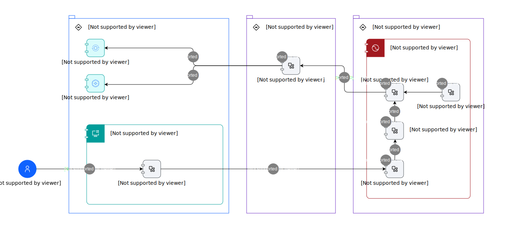

---
tags:
    - AOD-Usage
---

#  Maximo AI Assistant Pattern - Usage Scenario

## Step List

| Name | Description |
| --- | --- | 
 | 1 | 
The Maximo Skill Service is deployed to a container runtime (podman/docker/kubernetes)
 |
 | 2 | 
A new assistant the Maximo AI Assistant is developed using the Watsonx.orchestrate capability
 |
 | 3 | 
The actions of the new assistant are configured to forward requests to the newly created Maximo Custom extension
 |
 | 4 | 
The Maximo Skill Service OpenApi specification is obtained from the developers of the skill service
 |
 | 5 | 
The Maximo Custom Extension is built from the Maximo Skill Service API specification
 |
 | 6 | 
The MAS user accesses the Maximo AI Assistant using the code embedded into the UI of the MAximo Suite
 |
 | 7 | 
The MAS user interacts with the Maximo AI Assistant to do one of the following:
<ol><li>Retrieve unhealthy assets</li><li>Check asset for work order</li><li>Create work order for asset</li><li></li></ol> |
 | 8 | 
The Maximo AI Assistant forwards the requests to the custom extension
 |
 | 9 | 
The custom extension forward the requests to the Maximo Skill service
 |
 | 10 | 
The skill service invokes the relevant MAS Manage APi's and returns the result to the caller
 |
 | 11 | 
The skill service invokes the relevant MAS Health API's and returns the result to the caller
 |

    

