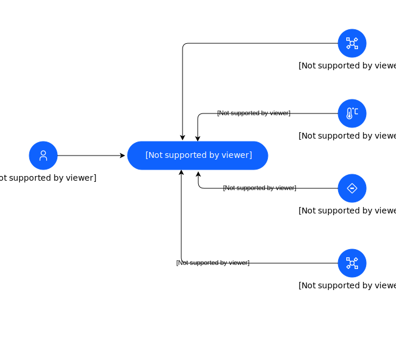

### Name

Intelligent Asset System Context

### Description

This is the system context diagram for the Intelligent Asset Reference Architecture.   At the center of the architecture is Maximo Application Suite.  Interactions are shown between Maximo Application Suite and other actors (external factors) in which the suite is designed to interface.

## Element(s)

### Target System(s)

| Name | Description |
| --- | --- |
 | Maximo Application Suite (MAS) | 
Maximo Application Suite (MAS) is a suite of Enterprise Asset Management tools designed to drive operational resiliency and reliability with condition-based asset maintenance.
 |

### Actor(s)

| Name | Description | Type | GenericGroup |
| --- | --- | --- | --- |
 | Control System-uploaded | 
A control system uses sensors and actuators to monitor and control the operation of a system or process. Control systems also can be used to automatically adjust the operation of a system based on predetermined set points, as well as to respond to changes in the environment or to commands from operators.
 | IT System | 
<strong>SubSystem,Maximo Application Suite Core</strong>[Auto-Generated]

This group is derived from SubSystem named Maximo Application Suite Core.
 |
 | Edge Devices-uploaded | 
Companies that manufacture supported edge devices include Telit, Osisoft, Hilscher, Cisco, Advantech, Fluck and Harting.
 | IT System | 
<strong>SubSystem,Maximo Application Suite Core</strong>[Auto-Generated]

This group is derived from SubSystem named Maximo Application Suite Core.
 |
 | Enterprise Assets-uploaded | 
From an asset management perspective, enterprise assets include but are not limited to:  (1) building assets, (2) manufacturing assets, (3) aviation assets, (4) civil infrastructure assets, (5) life science assets, (6) transportaion assets, (7) utility assets, and (8) Oil &amp; gas assets.
 | IT System | 
<strong>SubSystem,Maximo Application Suite Core</strong>[Auto-Generated]

This group is derived from SubSystem named Maximo Application Suite Core.
 |
 | MAS User-uploaded | 
The Maximo Application Suite allows users to sign on to a single, integrated platform to access key monitoring, maintenance, and reliability applications across the business. Not only does it help remove data silos, it enhances data sharing with integrated user experience and shared administrative controls for enterprise-scale execution. With a new Committed Term License, businesses can access the entire suite with one single entitlement. Users in the organization will have a pool of AppPoints that will allow them to seamlessly move from one application to another, as needed. This enables organizations to pay for only what they use. You can try and deploy new applications without substantial license and administration costs. It also allows your team to deploy new capabilities and grow as well as share industry specific Digital Twin assets and modules.
 | Human | 
<strong>SubSystem,Maximo Application Suite Core</strong>[Auto-Generated]

This group is derived from SubSystem named Maximo Application Suite Core.
 |
 | Sensors-uploaded | 
IoT sensors are pieces of hardware that detect changes in an environment and collect data.  The type of IoT sensors include:  temperature sensors, proximity sensors, pressure sensors, water quality sensors, chemical and gas sensors, infrared sensors, smoke sensors, motion sensors, and optical sensors to name a few.
 | IT System | 
<strong>SubSystem,Maximo Application Suite Core</strong>[Auto-Generated]

This group is derived from SubSystem named Maximo Application Suite Core.
 |

