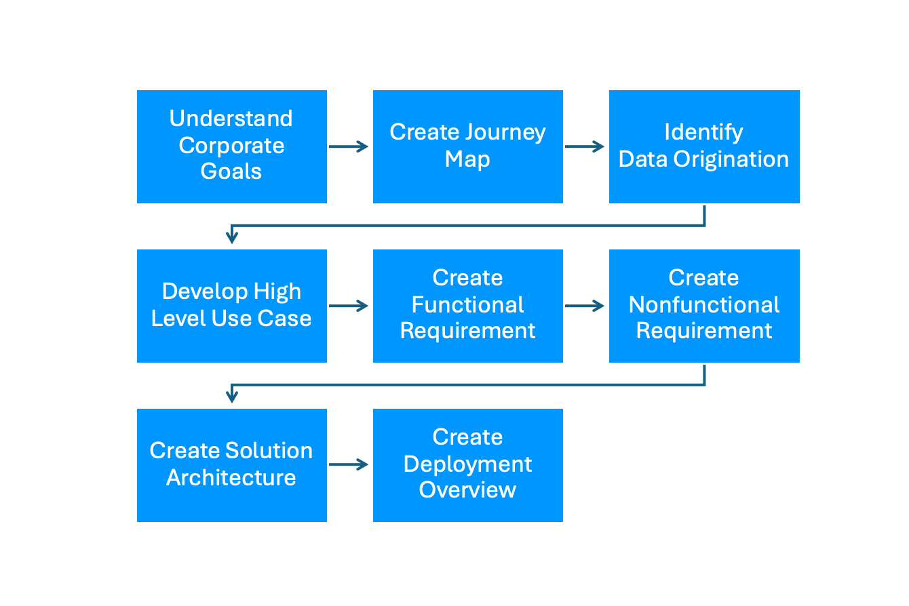
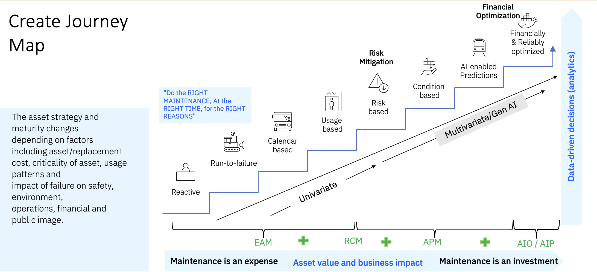

# Overview

<h2><strong>Intelligent Asset Reference Architecture Project Definition</strong></h2>
The Intelligent Asset Reference Architecture provides recommended structures and integrations as a single access point for a suite of asset lifecycle management capabilities. The suite allows users to sign on to a single, integrated platform to access key monitoring, maintenance, and reliability applications across the business. Not only does it help remove data silos, but it also enhances data sharing with integrated user experience and shared administrative controls for enterprise-scale execution.
<h2>Building the Intelligent Asset Reference Architecture</h2>
Building an intelligent reference architecture involves a systematic process that aligns with corporate goals and leverages advanced technologies for optimal results. The first step is understanding <strong>corporate goals</strong> and ensuring the architecture aligns with the organization's strategic objectives. Next, <strong>create a journey map</strong> to visualize the stages of implementation and the interaction of various components. The third step is <strong>identifying data origination</strong> and determining where and how data will be generated, collected, and stored. Following this, <strong>develop high-level use cases</strong> that define the main functions and benefits of the architecture, providing a broad perspective of its applications.

After establishing use cases, it's crucial to <strong>create functional requirements</strong> detailing the specific features and operations the system must support. Simultaneously, <strong>create non-functional requirements</strong> that outline the system's performance criteria, such as scalability, reliability, and security. With these requirements in place, the next step is to <strong>create the solution architecture</strong>, designing the structure of the system, including the components, their relationships, and how they interact to meet both functional and non-functional requirements.

Finally, <strong>create a deployment overview</strong> that outlines the plan for implementing the architecture, including timelines, resources, and processes for deploying and maintaining the system. This comprehensive approach ensures that the intelligent reference architecture is robust, scalable, and aligned with the organization's strategic goals, thereby supporting effective decision-making and operational efficiency.

<h2>Understand Corporate Goals</h2>
Understanding corporate goals in asset management involves a structured process to ensure alignment with organizational objectives and optimal resource use. The process begins with <strong>stakeholder interviews</strong>, gathering insights and expectations from key individuals across the organization. Next, <strong>define objectives</strong> to clarify what the asset management program aims to achieve in line with the company’s broader goals. Following this, <strong>develop a framework</strong> that outlines the approach and methodologies to be used.

A <strong>gap analysis</strong> is conducted to identify discrepancies between the current state and desired outcomes, highlighting areas that need improvement.Based on this analysis, <strong>develop a strategy</strong> that addresses these gaps and aligns asset management practices with corporate goals. The strategy incorporates <strong>tools and technology</strong> to enhance efficiency and data accuracy.

The next step is to <strong>implement the plan</strong>, ensuring all components are in place and operational. Finally, <strong>monitor and review</strong> the implemented strategy regularly to assess its effectiveness, make necessary adjustments, and ensure continuous alignment with corporate objectives. This comprehensive approach ensures that asset management practices support the organization's overall mission and goals.
<h2>Create Journey Map</h2>
The journey map of intelligent reference architecture illustrates the progression from traditional to sophisticated, technology-driven maintenance management strategies. Initially, legacy asset management practices heavily relied on reactive measures, with a "run to fail" mentality and calendar-based maintenance schedules. This approach increased downtime and higher maintenance costs due to its inefficiency and lack of predictive capabilities. Over time, organizations began to adopt usage-based and risk-based maintenance strategies, focusing on the reliability of critical assets and cost control through more targeted maintenance efforts. These strategies established the foundation for reliability-centered maintenance, prioritizing activities based on asset criticality and operational impact.

As technology advanced, companies transitioned to condition-based maintenance, leveraging real-time data to monitor asset conditions and predict failures. This shift marked a move towards asset performance-based maintenance, utilizing AI and IoT for predictive insights and proactive management. The latest stage in this evolution is the adoption of Asset Investment Optimization and Planning (AIO/AIP). This approach applies financial and reliability optimization techniques to maximize asset value and returns on investment. Enterprise organizations are now viewing maintenance not as an expense but as a strategic investment.

By integrating advanced analytics and AI, businesses can optimize maintenance schedules, reduce unexpected downtimes, and extend the lifespan of assets. This proactive approach enhances operational efficiency and supports sustainability objectives by minimizing resource wastage and improving the overall environmental impact. Consequently, maintenance strategies have become essential in delivering both economic and ecological value for enterprises.   
<h2>IBM Applications to Support the Asset Management Journey</h2>
IBM Maximo Applications such as Manage, Visual Inspection, Monitor, Health, Predict, Mobile, Reliability Strategy, and Assist play a crucial role in advancing the journey from traditional asset management to sophisticated, technology-driven maintenance strategies. Maximo Manage facilitates efficient enterprise asset management by streamlining operations and enhancing visibility into asset performance. Visual Inspection uses AI to detect defects and anomalies, enabling proactive maintenance. Maximo Monitor provides real-time monitoring capabilities, while Maximo Health offers comprehensive insights into asset health and predictive maintenance needs. Maximo Predict leverages AI and machine learning to forecast potential failures, ensuring timely interventions. Maximo Mobile supports field technicians with real-time data and guidance, increasing maintenance efficiency. Maximo Reliability Strategy aids in developing reliability-centered maintenance plans, and Maximo Assist offers remote assistance and expertise to on-site teams. Collectively, these applications optimize maintenance schedules, reduce downtime, and extend asset lifespans, transforming maintenance from a cost center to a strategic investment that supports sustainability and operational efficiency.

The Intelligent Asset Reference Architecture is a building block for complimentary solution architectures for applications as part of the suite. Key asset management capabilities within the suite include: managing, monitoring, evaluating health, predicting failures, and visual inspection, to name a few. Customers can start at any point in the asset lifecycle and expand into other areas. A depiction of the intelligent asset journey is in the image below.

This flexibility uses a simplified, suite-based licensing structure and does not require additional provisioning. Through Red Hat OpenShift and hybrid cloud deployment, provisioning the suite across multiple clouds, on-premises, or hosted as a managed service on IBM Cloud is achievable.
<h2><strong>Intelligent Asset Reference Architecture</strong></h2>
The Intelligent Asset Reference Architecture provides recommended structures and integrations as a single access point for a suite of asset lifecycle management capabilities. The suite allows users to sign on to a single, integrated platform to access key monitoring, maintenance, and reliability applications across the business. Not only does it help remove data silos, but it also enhances data sharing with integrated user experience and shared administrative controls for enterprise-scale execution. The Intelligent Asset Reference Architecture is a building block for complimentary solution architectures for applications as part of the suite. Key asset management capabilities within the suite include: managing, monitoring, evaluating health, predicting failures, and visual inspection, to name a few. Customers can start at any point in the asset lifecycle and expand into other areas. A depiction of the intelligent asset journey is in the image below.

This flexibility uses a simplified, suite-based licensing structure and does not require additional provisioning. Through Red Hat OpenShift and hybrid cloud deployment, provisioning the suite across multiple clouds, on-premises, or hosted as a managed service on IBM Cloud is achievable.

The <strong>Intelligent Asset Reference Architecture</strong> is core to the overall suite of applications. Therefore, the current and future approach to documenting <strong>Intelligent Asset</strong> architectures is as follows:
<ul><li><strong>Intelligent Asset</strong> Reference Architecture (core)<ul><li><strong>Intelligent Asset Inspection</strong> Architecture (Phase 1: Visual Inspection)</li><li><strong>Intelligent Asset Insights</strong> Architecture (Phase 2: Monitor, Health, Predict)</li><li><strong>Intelligent Asset Mobile</strong> Application Architecture (Phase 3: Mobile)</li><li><strong>Intelligent Asset Reliability</strong> Architecture (Phase 3: Safety)</li></ul></li></ul>
In Phase 1 of this project, the <a href="https://pages.github.ibm.com/skol/hypersonic-intelligent-asset-inspection/">Intelligent Asset Inspection Technology Pattern</a> includes a complementary <a href="https://pages.github.ibm.com/solution-architectures/intelligent-asset-inspection/">Intelligent Asset Inspection solution architecture</a> as part of this Intelligent Asset Reference Architecture (core). The purpose of a technology pattern is to codify existing design knowledge so that specialists and architects are not constantly reinventing the wheel.

With Intelligent Assets, customers achieve sustainable asset management and reliability optimization. They can enable the creation of resilient and sustainable infrastructure and operations to extend the life of equipment, buildings, bridges, fleets, water lines, and more to reach sustainability targets. The most popular use cases for the suite include but are not limited to:
<ol><li><strong>Asset Management & Maintenance:</strong> Optimize maintenance schedules to achieve efficient, safe, and sustainable work practices.</li><li><strong>Asset Reliability and Optimization:</strong> Extending asset life decreases waste & embodied carbon and improves energy efficiency.</li><li><strong>Asset Monitoring and Fault Detection:</strong> Increased energy efficiency, equipment performance, and reliability.</li></ol>
If you have any questions or comments, please send emails to SSW-Architecture-Questions@ibm.com  

