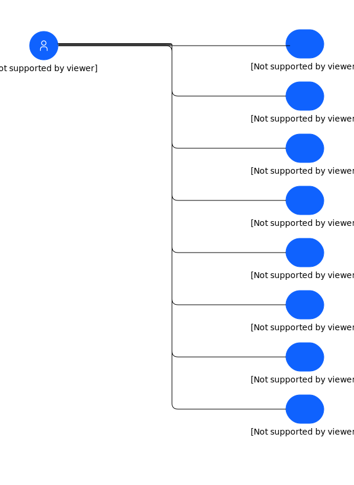

---
tags:
    - UCD
---

#  Intelligent Asset Use Case-uploaded

## Element(s)

### Actor(s)

| Name | Description | Type | GenericGroup |
| --- | --- | --- | --- |
 | MAS User-uploaded | 
The Maximo Application Suite allows users to sign on to a single, integrated platform to access key monitoring, maintenance, and reliability applications across the business. Not only does it help remove data silos, it enhances data sharing with integrated user experience and shared administrative controls for enterprise-scale execution. With a new Committed Term License, businesses can access the entire suite with one single entitlement. Users in the organization will have a pool of AppPoints that will allow them to seamlessly move from one application to another, as needed. This enables organizations to pay for only what they use. You can try and deploy new applications without substantial license and administration costs. It also allows your team to deploy new capabilities and grow as well as share industry specific Digital Twin assets and modules.
 | Human | 
<strong>SubSystem,Maximo Application Suite Core</strong>[Auto-Generated]

This group is derived from SubSystem named Maximo Application Suite Core.
 |

### Use Case(s)
| Name | Description |
| --- | --- |
| Manage: Manage asset maintenance-uploaded | Manage Use Case: Understand and manage asset maintenance  Reduce downtime and costs by optimizing asset management and maintenance processes to improve operational performance. Leverage embedded industry expertise with best-practice data models and workflows to accelerate your industry transformation. Unify asset management processes using role-based workspaces to help teams across your enterprise. Maximo Manage unifies robust asset life cycle and maintenance management activities, providing insight into all enterprise assets, their conditions and work processes to achieve better planning and control. | 
| Monitor: Achieve asset monitoring at scale-uploaded | Monitor Use Case:  Achieve advanced AI-powered remote asset monitoring at scale  Improve asset and operational availability with advanced AI-powered remote asset monitoring at scale. Collect data from your existing OT systems, an converge your IT systems and operational systems in a single data lake to detect anomalies   | 
| Health: Manage the health of your assets-uploaded | Health Use Case:  Manage the health of your assets using IoT data from sensors, records and work history  Manage the health of your assets using IoT data from asset sensors, asset records and work history to increase asset availability and improve replacement planning. Get a true view of asset health via dashboard displays to provide evidence to base operational decisions. | 
| Predict: Predict the likelihood of future failures-uploaded | Predict Use Case:  Predict future failures by applying ML and data analytics  Go beyond time-scheduled maintenance to condition-based action to predict the likelihood of future failures by applying machine learning and data analytics to reduce cost and asset failures. Build on the power of other Maximo capabilities and Watson Studio to make data-driven decisions and build predictive models. | 
| Visual Inspection: Visually detect anomalies-uploaded | Use Case:V isually detect anomalies with AI powered insights  Perform a visual inspection of the line or asset using commercial, off-the-shelf iOS devices to get immediate, actionable notifications of any emerging issue. Scale easily to view multiple points 24/7 including global views of all plants and geographies. Integrate with maintenance and quality workflows for a fast and prescriptive response. | 
| Mobile: Manage any asset, anytime, any place.-uploaded | Mobile Use Case: Manage any asset, anytime, any place.  Built on next-generation mobile technology, Maximo Mobile boosts productivity by giving field technicians the power to easily navigate a single, intuitive platform and find the right asset history and operational data —even in the most remote locations, online or offline—all in the palm of their hand  | 
| Safety: Use Data to protect workers-uploaded | Safety Use Case:  Use Data to protect workers  Establish safer working environments by providing safety insights for proactive protection with personalized risk assessment and near real-time protection. These insights and protection can minimize workplace hazards. | 
| Assist: Collaborate with experts to resolve problems-uploaded | Assist Use Case:  Gain cognitive insights and remote collaboration  Provides technician with AI-powered guidance through a knowledge base of equipment maintenance data and gives them remote access to experts for assistance. Using an intuitive mobile interface, technicians can diagnose equipment problems, find recommended solutions, and collaborate with experts to resolve problems. | 

### Associations(s)

All associations are not named.

    

